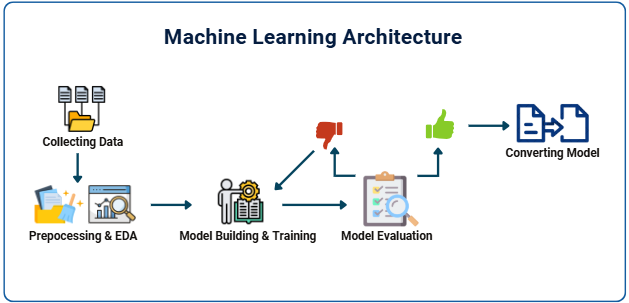

<h1 align="center">
  
   
  MACHINE LEARNING README
</h1>

# Team Profile

### Team ID : C242-PS019

### This is our Members

* (ML) M413B4KX3878 - Riska Dewi Yuliyanti - Sekolah Tinggi Teknologi Wastukancana
* (ML) M211B4KX0695 - Ashtri Cahyani - Universitas Indraprasta PGRI
* (ML) M312B4KX2146 - Kartika Rahma Sulistyawati - Universitas Sebelas Maret
* (CC) C413B4KY4123 - Shandy Satria Nugraha - Sekolah Tinggi Teknologi Wastukancana
* (CC) C764B4KX1539 - Fitri Sri Mulyani	- Sekolah Tinggi Teknologi Bandung
* (MD) A211B4KY1765 - Hendriansyah Rizky Setiawan - Universitas Indraprasta PGRI
* (MD) A211B4KY2173 - Kenny Josiah Silaen - Universitas Indraprasta PGRI

### Roles/personnel

* Project Plan ( M413B4KX3878 - Riska Dewi Yuliyanti, M211B4KX0695 - Ashtri Cahyani, M312B4KX2146 - Kartika Rahma Sulistyawati, C413B4KY4123 - Shandy Satria Nugraha, C764B4KX1539 - Fitri Sri Mulyani, A211B4KY1765 - Hendriansyah Rizky Setiawan, A211B4KY2173 - Kenny Josiah Silaen )
* UI/UX ( A211B4KY1765 - Hendriansyah Rizky Setiawan, A211B4KY2173 - Kenny Josiah Silaen, M413B4KX3878 - Riska Dewi Yuliyanti, C413B4KY4123 - Shandy Satria Nugraha )
* Build Machine Learning Model ( M312B4KX2146 - Kartika Rahma Sulistyawati, M413B4KX3878 - Riska Dewi Yuliyanti, M211B4KX0695 - Ashtri Cahyani )
* Android Apps Development ( A211B4KY1765 - Hendriansyah Rizky Setiawan, A211B4KY2173 - Kenny Josiah Silaen )
* Deployment Application ( C413B4KY4123 - Shandy Satria Nugraha, C764B4KX1539 - Fitri Sri Mulyani )

# KidCare Machine Learning Project
This ML project is our final project for Google Bangkit Academy 2024 Batch 2.

**Cloud Computing:**
[GitHub KidCare Cloud Computing](https://github.com/KidCare-Capstone-Project/Cloud_computing)

**Mobile Development:**
[GitHub KidCare Mobile Development](https://github.com/KidCare-Capstone-Project/MobileDev_Apps)

**Project Background:**

Stunting is a condition of chronic malnutrition experienced by children, which results in impaired physical growth and brain development. Children who experience stunting will be shorter than children of the same age, and are at risk of learning difficulties and poor health in the future. The causes of stunting vary, ranging from lack of access to adequate nutrition, parental knowledge about nutrition, to less supportive sanitation and environmental conditions.

KidCare is here as a digital solution that provides information, education, and monitoring features for parents and health workers. Through this application, users will get guidance and tools to monitor child growth in order to prevent stunting as early as possible. This team developed an application that prioritizes easy access to information and monitoring of child development to help reduce stunting rates in Indonesia.

**Machine Learning:**

The KidCare application uses Machine Learning to predict stunting based on children's health data. The following tools and techniques will be used in the implementation:

- TensorFlow: Used to build and train the stunting prediction model using children's health data.

- TensorFlow Lite: Used to run the trained model on the Android app, enabling fast predictions on devices.

- Google Colab: Used for developing and training the model in an easy to use environment.

**Case:**

In its implementation, the KidCare application helps health workers and parents in overcoming the problem of stunting. For example, a mother in a remote area can use this application to monitor the development of her child's weight and height. Based on the inputted data, the application will provide a warning if there are indications of stunting in the child and provide recommendations for appropriate diet and nutrition patterns.

The team will focus on developing and testing the following features:

- Growth Monitoring and Analysis: Routinely monitor children's height, weight, and head circumference and compare them with WHO standard data.

- Nutrition and Health Education: Provide educational content for parents about the importance of balanced nutrition and child health care.

- Notifications and Reminders: Provide reminders for routine health checks and vaccinations according to the child's age.

- Data Visualization: Displays child development graphs in an easy-to-understand manner, making it easier to monitor.

- This application is expected to be an innovative solution that can help the government and society in reducing stunting rates and supporting the creation of a healthy and intelligent generation in Indonesia.

## Documentation ML Architecture

  

## Machine Learning Roadmap  

**Environment Setup**
- [Google Colab](https://colab.research.google.com/) for ML development

**Data Preprocessing**
- [Pandas](https://pandas.pydata.org/) for data preprocessing
- [NumPy](https://numpy.org/) for numerical computations

**Data Visualization**
- [Matplotlib](https://matplotlib.org/) for data visualization
- [Seaborn](https://seaborn.pydata.org/) for enhanced data visualization

**Imbalanced Data Handling**
- [Imbalanced-learn](https://imbalanced-learn.org/stable/) for handling imbalanced datasets

**Model Building and Training**
- [TensorFlow](https://www.tensorflow.org/) for building and training ML models

**Model Evaluation**
- [Scikit-learn](https://scikit-learn.org/stable/) for evaluation metrics and model performance analysis

**Model Conversion**
- [TensorFlow Lite](https://www.tensorflow.org/lite) for deploying models on Android devices

## Feature
- Stunting Calculator

## Requirement
- Google Colab
- TensorFlow 2.18.0
- TensorFlow Lite
- Pandas 2.2.2
- NumPy 1.26.4
- Matplotlib 3.8.0
- Seaborn 0.13.2
- Scikit-learn 1.5.2
- Imbalanced-learn 0.12.4

## Running the KidCare ML Notebook

### 1. Download the Notebook and Dataset Files
- **Download the notebook file**: [KidCare_Predict.ipynb](https://github.com/KidCare-Capstone-Project/ML_Structuring_Model/blob/main/notebook/KidCare_Predict.ipynb)
- **Download the dataset file**: [Dataset_Stunting.csv](https://github.com/KidCare-Capstone-Project/ML_Structuring_Model/blob/main/dataset/Dataset_Stunting.csv)

### 2. Open the Notebook in Google Colab
- Go to [Google Colab](https://colab.research.google.com).
- Click on **File > Upload notebook**, then select the `KidCare_Predict.ipynb` file downloaded earlier.

### 3. Upload the Dataset to Google Colab
- In Google Colab, go to the **Files** section on the left panel.
- Click **Upload**, then select the dataset file to upload from the computer.

### 4. Run the Notebook
- After uploading the dataset, run all the cells in the notebook by selecting **Runtime > Run all**.
